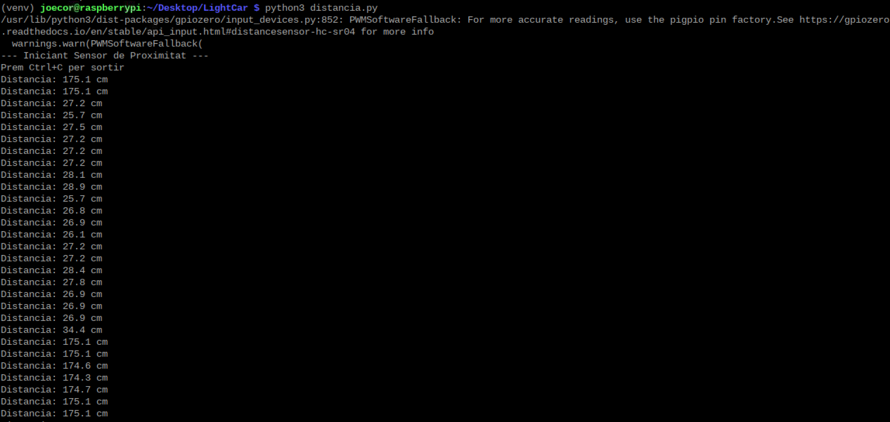
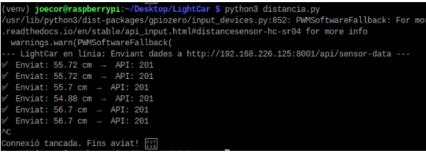
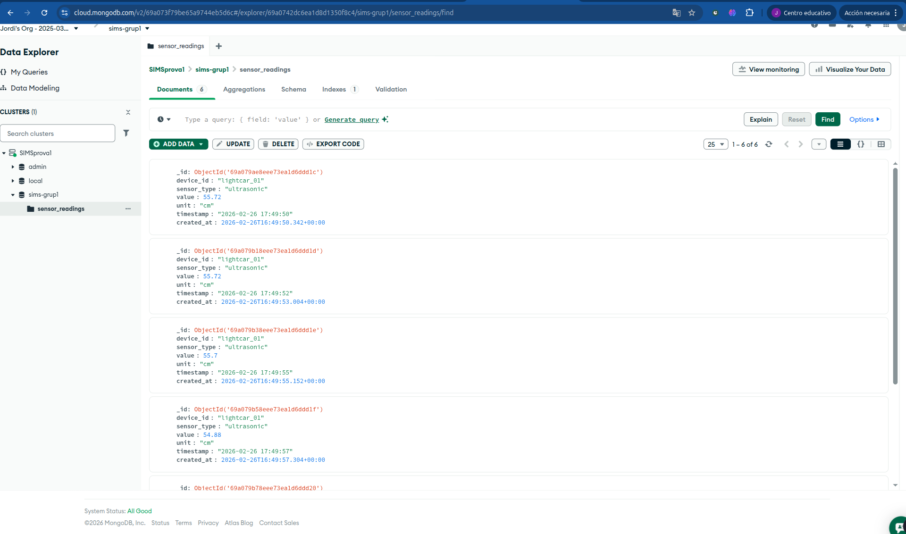

# Documentació de Proves

---

## Prova 1 - Que funcioni la pantalla LED amb text personalitzat

Aquesta primera prova ens serveix per comprovar que la raspberry pot mostrar informació del sistema a la pantalla LCD.

Una utilitat podría ser que ens mostri l'ubicació, l'estat de la batería, la marca/model del vehicle etc.

```python
from rpi_lcd import LCD
import time

try:
    lcd = LCD(address=0x3f)
except OSError:
    print("Error: No s'ha pogut trobar la pantalla a l'adreça 0x3f.")
    print("Revisa que els cables SDA i SCL estiguin ben connectats.")
    exit()

def iniciar_pantalla():
    try:
        print("Escrivint a la pantalla LCD...")

        # Netegem per si hi havia text anterior
        lcd.clear()

        # Escrivim missatges de prova
        lcd.text("LightCar: Actiu", 1)  # Línia 1
        lcd.text("Usuari: joecor", 2)   # Línia 2

        print("Codi executant-se correctament. Prem Ctrl+C per sortir.")

        # Mantenim el programa viu perquè no s'apagui la pantalla
        while True:
            time.sleep(1)

    except KeyboardInterrupt:
        print("\nAturant el programa...")
        lcd.clear()
    except Exception as e:
        print(f"S'ha produït un error inesperat: {e}")

if __name__ == "__main__":
    iniciar_pantalla()
```


---

## Prova 2 - El led s'actualitza amb la tecla premuda del panel

En aquesta prova, si l'usuari prem el panel, la pantalla LCD interpreta la tecla i mostra la tecla que ha premut per pantalla.

Això ens podrà servir per exemple per desbloquejar el vehicle amb una contrasenya.


---

## Prova 3 - Mesurar la distància a la qual està un objecte del sonar

Hem fet una prova amb el sensor d'ultrasons HC-SR04, on el sistema mesura el temps que triga una ona sonora a rebotar contra un objecte per calcular-ne la distància exacta en centímetres, tal com es mostra a la consola de depuració.

Aquesta funció ens seria molt útil, ja que podríem detectar obstacles a la carretera i també ho incorporaríem a l'assistent d'aparcament per facilitar les maniobres. (Per exemple a menys de 30 cm afegiríem un soroll intermitent)




---

## Prova 4 - Mesurar la distància i enviar les dades a MongoDB Atlas via API

### 4.1 - Que hem fet?

#### 4.1.1 - El problema

La Raspberry Pi llegeix distàncies amb el sensor ultrasònic HC-SR04, però necessitàvem **guardar les dades a la núvol** (MongoDB Atlas).

No podíem connectar la Raspberry directament a MongoDB perquè:
- La Raspberry no hauria de gestionar credencials de base de dades
- Si canviem de base de dades, hauríem de modificar el codi de la Raspberry
- No hi ha comunicació directa front-end ↔ subsistema IoT

### 4.2 - La solució

Hem creat un microservei FastAPI que actua d'intermediari:

```
Raspberry Pi  →  Microservei FastAPI  →  MongoDB Atlas
```


### 4.3 - Resum del flux

La Raspberry Pi envia dades al FastAPI → FastAPI les desa a MongoDB Atlas

### 4.4 - Noves coses a implementar

Implementar un flux de dades on el Frontend realitza una consulta al Backend (Laravel); aquest, mitjançant un servei d'API, gestiona la petició cap a MongoDB Atlas. Un cop obtinguda la resposta de la base de dades, la informació retorna en cascada a través de l'API cap a Laravel, que finalment la lliura al Frontend per a la seva visualització.

---

### Codi Python per executar l'script:

```python
from gpiozero import DistanceSensor
import time
import requests
import json

# 1. Configuració del sensor
sensor = DistanceSensor(echo=24, trigger=23, max_distance=2)

# 2. URL de la teva API Microservice (canvia-la per la teva!)
API_URL = "http://192.168.1.XX:8000/api/sensor-data"

print(f"--- LightCar en línia: Enviant dades a {API_URL} ---")

try:
    while True:
        distancia_cm = round(sensor.distance * 100, 2)

        # Preparem el paquet JSON seguint l'esquema del teu diagrama
        payload = {
            "device_id": "lightcar_01",
            "sensor_type": "ultrasonic",
            "value": distancia_cm,
            "unit": "cm",
            "timestamp": time.strftime("%Y-%m-%d %H:%M:%S")
        }

        try:
            # Enviem el POST cap a l'API Microservice
            response = requests.post(API_URL, json=payload, timeout=2)

            if response.status_code == 201 or response.status_code == 200:
                print(f" Enviat: {distancia_cm} cm (Resposta API: {response.status_code})")
            else:
                print(f" Error API: {response.status_code}")

        except requests.exceptions.RequestException as e:
            print(f" Error de connexió: No s'ha pogut arribar a l'API")

        # Esperem 2 segons per no col·lapsar la base de dades MongoDB
        time.sleep(2)

except KeyboardInterrupt:
    print("\nConnexió tancada.")
```

### Retorna a la Raspberry:



### Retorn al MongoDB:



